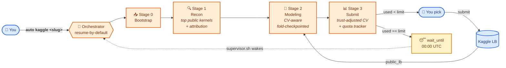

<div align="center">

# 🎯 auto-kaggle

### Drop a URL. Hunt Medals.<br/>Autonomous · CV-First · Crash-Safe.

*Just tell Claude Code or Codex:* **`auto kaggle <slug>`**
*→ multi-day grinding → ranked candidates → you pick the final 2.*

<!-- A hand-drawn hero image can be dropped into docs/hero.png.
     See docs/hero-prompt.md for a verbatim prompt you can paste into
     GPT-image-1 / Midjourney / Gemini. The README does not break
     without the image — the mermaid diagram below is the canonical hero. -->

[](LICENSE)
[](#)
[](#)
[](https://claude.ai/code)
[](#)
[](auto-kaggle/SKILL.md)
[](audit/codex-review-2026-05-12.md)

</div>



<div align="center"><sub><i>Multi-day, multi-process. Resume-by-default. Claude Code <code>/loop</code> or <code>supervisor.sh</code> keeps it alive until the deadline (or a <code>STOP</code> file).</i></sub></div>

---

## ✨ What it does

Drop in a Kaggle competition URL. The skill suite — five staged Claude / Codex agents — boots the run, periodically scrapes top public kernels for ideas (with mandatory attribution), trains its own CV-aware pipeline with fold-by-fold checkpoints, and surfaces ranked submission candidates with real-time quota: *"3/5 used today · next reset in 2h 17m."* You pick which to submit. It survives crashes, context resets, network blips, and quota exhaustion via append-only logs, atomic writes, and a `wait_until.txt` sleep protocol.

**Default goal:** lock silver, reach for gold. **Final 2 submissions:** always your call.

## 🚀 In 60 seconds

```bash
# 1) Install Kaggle CLI + accept comp rules in your browser
pip install --upgrade kaggle
mkdir -p ~/.kaggle && mv ~/Downloads/kaggle.json ~/.kaggle/ && chmod 600 ~/.kaggle/kaggle.json

# 2) Drop the 5 skill folders into Claude Code (or Codex skills dir)
mkdir -p ~/.claude/skills
cp -r auto-kaggle auto-kaggle-bootstrap auto-kaggle-recon \
      auto-kaggle-modeling auto-kaggle-submit ~/.claude/skills/

# 3) Tell Claude Code / Codex:
#       auto kaggle https://www.kaggle.com/competitions/playground-series-s4e5
#    (or just `auto kaggle playground-series-s4e5`)
```

That's it. The bootstrap stage asks you 4 questions (compute env, Kaggle handle, target tier, supervisor mode), then the loop runs.

## ⚙️ The 5 skills

| Skill | Role | Reads | Writes |
|---|---|---|---|
| 🎯 [`auto-kaggle`](auto-kaggle/SKILL.md) | Orchestrator (routing + gating, no research) | `run.yaml`, all stages' `hand_off.md` | `.heartbeat`, `progress.jsonl` |
| 📥 [`auto-kaggle-bootstrap`](auto-kaggle-bootstrap/SKILL.md) | Stage 0: parse comp, download data, detect task type | comp URL, user answers | `comp_profile.yaml`, `rules_summary.md`, `compute_env.yaml` |
| 🔍 [`auto-kaggle-recon`](auto-kaggle-recon/SKILL.md) | Stage 1: pull top public kernels, distill ideas with citations | `comp_profile.yaml`, last recon ts | `ideas_pool.md`, `citations.bib`, `kernels_index.json` |
| 🧪 [`auto-kaggle-modeling`](auto-kaggle-modeling/SKILL.md) | Stage 2: own pipeline, CV-aware training, ablations | `ideas_pool.md`, `compute_env.yaml` | `pipeline.py`, `leaderboard.csv`, fold OOFs |
| 📊 [`auto-kaggle-submit`](auto-kaggle-submit/SKILL.md) | Stage 3: rank, track quota, write recs, submit on user pick | `leaderboard.csv`, `submission_log.jsonl` | `recommendations.md`, `quota_state.yaml`, `wait_until.txt` |

Plus four templates under `auto-kaggle-modeling/assets/templates/`: fully-functional **`tabular-lgbm`** and **`ensemble`** (blend/stack), plus skeletons for **`vision-timm`**, **`vision-timm-seg`**, **`vision-det`**, **`nlp-hf`**.

## 📁 What ends up on disk

```text
runs/<comp_slug>/
├── run.yaml               # comp slug, compute env, target tier, deadline, supervisor mode
├── .heartbeat             # {stage, substep, ts_utc, pid} — peek anytime
├── progress.jsonl         # append-only micro-step log
├── data/raw/              # `kaggle competitions download` output (gitignored)
├── stage0_bootstrap/      # comp_profile.yaml, rules_summary.md, compute_env.yaml
├── stage1_recon/          # ideas_pool.md, citations.bib, kernels/
├── stage2_modeling/       # pipeline.py, runs/<run_id>/, leaderboard.csv
├── stage3_submit/         # recommendations.md, submission_log.jsonl, quota_state.yaml,
│                          # wait_until.txt (when daily quota is exhausted), final_selection.md (last 24h)
└── STOP / PAUSE           # touch to stop / pause cleanly
```

## 🔥 Why it doesn't die mid-run

Kaggle competitions run for **days to months**, and the agent will be killed many times (context fills, laptop closes, network blips). The skill is built to come back:

| Failure | What survives | Why |
|---|---|---|
| Claude Code `/clear` | Everything | Zero memory crosses invocations — all state is on disk |
| Mid-fold crash | All prior folds | Per-fold OOFs saved atomically, sidecar score files preserve CV |
| Mid-submit network drop | The submission log | `submission_log.jsonl` is append-only; `kaggle competitions submissions` is reconciled-against on resume |
| Daily quota burns out | The whole pipeline | `wait_until.txt` written; supervisor lets Stages 1–2 keep working, Stage 3 sleeps |
| Host reboot | All state | Atomic `.tmp` + rename for every write; `supervisor.sh` restarts the agent |
| Final 2 submission | **You** decide | Rules 3 & 9: deadline mode forces user gating; `final_selection.md` proposes SAFE + AMBITIOUS |

Three supervisor modes — pick by how long you can keep something running:

```bash
# (A) manual — you invoke whenever
> auto kaggle resume <slug>

# (B) Claude Code /loop — runs while Claude Code is open
> /loop /auto-kaggle resume <slug>

# (C) shell-supervisor — 24/7 on a machine that stays up
nohup bash auto-kaggle/assets/supervisor.sh <slug> > supervisor.log 2>&1 &
```

## 📜 Integrity rules

10 non-negotiables — full text in [`auto-kaggle/references/integrity-rules.md`](auto-kaggle/references/integrity-rules.md).

1. No verbatim copying from public kernels — ideas are re-implemented.
2. Every `submit -m` carries `attr: <author>/<kernel-slug>`.
3. CV-first selection — never rank by raw public LB.
4. No LB probing — near-duplicate submissions blocked locally.
5. Single account — multi-account refused.
6. Quota honesty — no random/duplicate predictions to burn slots.
7. CV split is set once, only the user changes it (no reverse-tuning to LB).
8. Compute budget gated before every run.
9. Last 24h: deadline mode — final 2 submissions always user-picked.
10. External data must be Kaggle-shared and user-approved.

These map 1-for-1 to code paths the [Codex audit](audit/codex-review-2026-05-12.md) verified.

---

<details>
<summary><b>🆕 New to Kaggle? Read this first.</b></summary>

### Who this is for
- You have a Kaggle account and can accept competition rules in your browser.
- You want to lock silver / reach gold (`silver-floor-gold-ceiling` is the default tier).
- You have at least one machine that can stay on for days (local GPU, cloud GPU, or an open Kaggle Notebook).
- You're willing to read `recommendations.md` once or twice a day and pick a candidate.

### Who this is **not** for
- People who have never seen a Kaggle competition — run `titanic` end-to-end first by hand.
- Knowledge / Tutorial competitions — bootstrap rejects them.
- People wanting to bypass quotas, multi-account, or strip attribution — Rules 1, 2, 5 block all of this.

### Walk through it once before targeting a medal

1. **Try the skill on Titanic first.** No medals on the line. You see how the 4 stages, the recommendations file, the quota tracker, the wait-until protocol all fit together.
2. **Pick a medium-popularity ongoing comp** (< 1000 teams, 1+ month to deadline). Let the skill run for a week and watch CV vs public LB tracking, and how the skill's top recommendation compares to what you'd have picked.
3. Only after that, point it at a comp you actually want to medal in.

This step matters more than any tooling below. Skip it and you'll burn GPU hours and submission slots on bad judgment calls.

### Vocabulary you should know

- **public LB vs private LB**: public scores ~30% of test in real time; private = the rest, revealed at deadline. Medals come from private LB. **Chasing public LB is the classic shake-up trap.**
- **shake-up**: large public→private rank movement; top-10 public falling to 200+ private is routine.
- **CV (cross-validation)**: your local score; the only signal that actually predicts private LB.
- **daily quota**: usually 5 submissions/day, resets 00:00 UTC.
- **attribution**: your submission message must name the public kernels that inspired this submission. The skill enforces this.

</details>

<details>
<summary><b>🛠 Installation</b></summary>

### Claude Code

```bash
mkdir -p ~/.claude/skills
cp -r auto-kaggle auto-kaggle-bootstrap auto-kaggle-recon \
      auto-kaggle-modeling auto-kaggle-submit ~/.claude/skills/
```

Or project scope: `<project>/.claude/skills/`. Then `/skills` to confirm all 5 names appear.

### Codex / OpenAI-compatible agents

Drop the same five folders into your Codex skills directory; `agents/openai.yaml` provides UI metadata.

### Kaggle CLI

```bash
pip install --upgrade kaggle
# Download kaggle.json from https://www.kaggle.com/<you>/account
mkdir -p ~/.kaggle && mv ~/Downloads/kaggle.json ~/.kaggle/ && chmod 600 ~/.kaggle/kaggle.json
kaggle competitions list   # should list comps if configured right
```

Open the target competition in a browser, log in, accept the rules. Without this `kaggle competitions download` returns 403.

</details>

<details>
<summary><b>📂 Repo layout</b></summary>

```text
auto-kaggle/             # orchestrator + state contract + integrity rules + supervisor.sh
auto-kaggle-bootstrap/   # Stage 0
auto-kaggle-recon/       # Stage 1
auto-kaggle-modeling/    # Stage 2 (+ templates: tabular-lgbm, ensemble, vision-timm[-seg], vision-det, nlp-hf)
auto-kaggle-submit/      # Stage 3
audit/codex-review-*.md  # external code audits
docs/                    # hero image + prompt for regenerating it
README.md  README.en.md  README.zh-CN.md
CLAUDE.md                # editor notes for Claude Code
```

Each skill folder has `SKILL.md` (workflow), `references/` (load-on-demand specs), `assets/` (helpers + templates), and `agents/openai.yaml` (Codex UI metadata).

</details>

<details>
<summary><b>📝 Notes (not legal advice)</b></summary>

- This is **infrastructure for grinding Kaggle**, not a disclaimer: if you violate Kaggle's rules, your account is still on the line.
- The skill **never auto-submits the final 2** — rules 3 + 9 force user gating in the last 24h.
- The skill **never modifies** `cv_split.yaml` on its own — once set, only you change it.
- Data lives under `runs/<comp_slug>/data/` and is `.gitignored`. Never commit it.
- Credentials (`kaggle.json`) live in `~/.kaggle/`, never under `runs/`.
- Detailed code audit in `audit/codex-review-2026-05-12.md`. The follow-up fix commit verifies every finding.

</details>

---

<div align="center"><sub>
中文版 → <a href="README.zh-CN.md">README.zh-CN.md</a> · Code under MIT · 2026
</sub></div>
