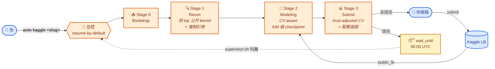

<div align="center">

# 🎯 auto-kaggle

### 扔个 URL,刷块奖牌。<br/>全自动 · CV 为先 · 崩了能续。

*对 Claude Code 或 Codex 说一句:* **`auto kaggle <slug>`**
*→ 自动跑数天 → 候选按 trust-adjusted CV 排序 → 你来挑最后 2 个。*

<!-- 想加手绘 hero 图,把生成结果丢到 docs/hero.png 即可,
     docs/hero-prompt.md 里有可以直接喂给 GPT-image-1 / Midjourney / Gemini 的 prompt。
     图缺失也不影响 README,下面的 mermaid 流程图就是默认 hero。 -->

[](LICENSE)
[](#)
[](#)
[](https://claude.ai/code)
[](#)
[](auto-kaggle/SKILL.md)
[](audit/codex-review-2026-05-12.md)

</div>



<div align="center"><sub><i>跨天/跨进程跑。默认 resume。Claude Code <code>/loop</code> 或 <code>supervisor.sh</code> 把它护到 deadline(或者你放个 <code>STOP</code> 文件)。</i></sub></div>

---

## ✨ 它在干嘛

你扔一个 Kaggle 比赛 URL 进来。5 个分阶段 Claude / Codex skill 把这个 run 启动起来,**定时抓 top 公开 kernel** 提炼想法(强制引用作者),**自己写 CV-aware 流水线** + fold 级 checkpoint 训练,把候选按 trust-adjusted CV 排序,实时显示配额:*"今日已用 3/5,下次刷新还有 2h 17m。"* 你来挑哪个提交。挂了能续 —— 通过 append-only 日志、原子写入、`wait_until.txt` 睡眠协议,扛得住 context 满、笔电关、断网、配额烧完。

**默认目标:** 稳银冲金。**最后 2 个 final submission:** 永远是你自己挑,skill 只排序 + 提建议。

## 🚀 60 秒上手

```bash
# 1) 装 Kaggle CLI,在浏览器里登录比赛页接受规则
pip install --upgrade kaggle
mkdir -p ~/.kaggle && mv ~/Downloads/kaggle.json ~/.kaggle/ && chmod 600 ~/.kaggle/kaggle.json

# 2) 5 个 skill 目录丢进 Claude Code(或 Codex skills 目录)
mkdir -p ~/.claude/skills
cp -r auto-kaggle auto-kaggle-bootstrap auto-kaggle-recon \
      auto-kaggle-modeling auto-kaggle-submit ~/.claude/skills/

# 3) 对 Claude Code / Codex 说一句:
#       auto kaggle https://www.kaggle.com/competitions/playground-series-s4e5
#    (或者就 `auto kaggle playground-series-s4e5`)
```

完。bootstrap 会问你 4 件事(算力环境 / Kaggle 用户名 / 目标段位 / 调度模式),之后就跑起来了。

## ⚙️ 5 个 skill 各自负责什么

| Skill | 角色 | 输入 | 输出 |
|---|---|---|---|
| 🎯 [`auto-kaggle`](auto-kaggle/SKILL.md) | 总控(只调度 + 守门,不做研究) | `run.yaml`,各 stage 的 `hand_off.md` | `.heartbeat`,`progress.jsonl` |
| 📥 [`auto-kaggle-bootstrap`](auto-kaggle-bootstrap/SKILL.md) | Stage 0:解析比赛 + 下数据 + 探任务类型 | URL + 用户 4 个答案 | `comp_profile.yaml`,`rules_summary.md`,`compute_env.yaml` |
| 🔍 [`auto-kaggle-recon`](auto-kaggle-recon/SKILL.md) | Stage 1:抓 top 公开 kernel,提炼 idea 带引用 | `comp_profile.yaml`,上次抓取时间 | `ideas_pool.md`,`citations.bib`,`kernels_index.json` |
| 🧪 [`auto-kaggle-modeling`](auto-kaggle-modeling/SKILL.md) | Stage 2:自己写 pipeline,CV-aware 训练,逐 idea ablation | `ideas_pool.md`,`compute_env.yaml` | `pipeline.py`,`leaderboard.csv`,fold OOF |
| 📊 [`auto-kaggle-submit`](auto-kaggle-submit/SKILL.md) | Stage 3:排候选、追配额、写推荐、按用户点头提交 | `leaderboard.csv`,`submission_log.jsonl` | `recommendations.md`,`quota_state.yaml`,`wait_until.txt` |

另外 `auto-kaggle-modeling/assets/templates/` 下有 4 个训练模板:**`tabular-lgbm`** 和 **`ensemble`**(blend/stack)是完整可跑,**`vision-timm`**、**`vision-timm-seg`**、**`vision-det`**、**`nlp-hf`** 是 skeleton,agent 按比赛实例化。

## 📁 跑起来后磁盘上长这样

```text
runs/<comp_slug>/
├── run.yaml               # 比赛 slug / 算力 / 段位 / deadline / supervisor 模式
├── .heartbeat             # {stage, substep, ts_utc, pid} — 任何时候可 cat 看
├── progress.jsonl         # append-only 微步骤日志
├── data/raw/              # `kaggle competitions download` 的产物(.gitignored)
├── stage0_bootstrap/      # comp_profile.yaml, rules_summary.md, compute_env.yaml
├── stage1_recon/          # ideas_pool.md, citations.bib, kernels/
├── stage2_modeling/       # pipeline.py, runs/<run_id>/, leaderboard.csv
├── stage3_submit/         # recommendations.md, submission_log.jsonl, quota_state.yaml,
│                          # wait_until.txt(配额烧完时),final_selection.md(deadline 前 24h)
└── STOP / PAUSE           # touch 即可干净停止 / 暂停
```

## 🔥 为什么不会跑着跑着死掉

Kaggle 比赛跨**天到月**,agent 会被无数种姿势杀掉(context 满、合笔电、网断、token 用完)。Skill 设计上对这些都是**可恢复**的:

| 故障 | 谁能挺住 | 为什么 |
|---|---|---|
| Claude Code `/clear` | 全部状态 | agent 跨调用零记忆,所有状态在磁盘上 |
| 训练 fold 中崩 | 已完成的 fold | 每个 fold 的 OOF 原子保存,sidecar score 文件保留 CV |
| 提交时断网 | submission log | `submission_log.jsonl` append-only,resume 时与 `kaggle competitions submissions` 对账 |
| 当日配额烧完 | 整条流水线 | 写 `wait_until.txt`,supervisor 让 Stage 1/2 继续工作,Stage 3 睡觉 |
| 主机重启 | 所有状态 | 每次写都 `.tmp` + rename,`supervisor.sh` 自动拉起 agent |
| 最后 2 个 final | **你**决定 | Rule 3 + 9:deadline 模式强制用户点头,`final_selection.md` 给 SAFE + AMBITIOUS 提案 |

3 种调度模式,按你能挂多久选:

```bash
# (A) manual:你每天有空的时候来一句
> auto kaggle resume <slug>

# (B) Claude Code /loop:Claude Code 开着就自己跑
> /loop /auto-kaggle resume <slug>

# (C) shell-supervisor:扔在 24h 开着的机器上,fire-and-forget
nohup bash auto-kaggle/assets/supervisor.sh <slug> > supervisor.log 2>&1 &
```

## 📜 Integrity rules(10 条硬约束)

详见 [`auto-kaggle/references/integrity-rules.md`](auto-kaggle/references/integrity-rules.md)。

1. 公开 kernel 不能 verbatim 抄,只取思路自己重写。
2. 每次 `submit -m` 都得带 `attr: <author>/<kernel-slug>`。
3. CV-first 选稿,永远不按 public LB 排名挑。
4. 不能 LB probing —— 近重复提交本地直接 block。
5. 单账号,多账号一律拒绝。
6. 配额诚实 —— 不允许提交乱数烧配额。
7. CV split 定下来后只有用户能改(防反向调到 LB)。
8. 跑训练前预算闸先过。
9. deadline 前 24h:最后 2 选必须用户点头。
10. 外部数据必须 Kaggle-shared 且用户批准。

10 条都在 [Codex 审计](audit/codex-review-2026-05-12.md) 里逐条对应到代码路径并核对过。

---

<details>
<summary><b>🆕 Kaggle 新手?先读这块再开干。</b></summary>

### 这个 skill 适合谁

- 已经有 Kaggle 账号、能登录、能在比赛页接受规则。
- 想稳一块银牌 / 冲一块金牌(默认段位就是 `silver-floor-gold-ceiling`)。
- 至少有一台机器能**长时间挂着**(本地 GPU / 云 GPU / 开着的 Kaggle Notebook)。
- 愿意每天看一两次 `recommendations.md`,在候选里挑一个让它提交。

### 这个 skill **不适合**谁

- 从没见过 Kaggle 比赛的人 —— 先手动刷个 `titanic` 走通一遍。
- Knowledge / Tutorial 类无奖牌比赛 —— bootstrap 直接拒。
- 想绕开配额、多账号、抄公开 kernel 不署原作者 —— Rule 1/2/5 直接挡。

### 第一次别就去打金牌

1. **先用 skill 跑一遍 Titanic**。没奖牌、零代价,体感 4 个 stage / recommendations.md / 配额追踪 / wait_until 是怎么联动的。
2. **挑 1 个中等热度的进行中比赛**(< 1000 队、deadline 还有 1 个月以上的 Playground Series 比较合适)。让 skill 全自动跑一周,观察 CV vs public LB gap、skill 推荐的 top 候选你自己会不会同意。
3. 等以上两步走顺,再去打你真正想拿牌的那个。

这一步比下面任何技术准备都重要。否则只是在烧 GPU 时间和提交配额。

### 几个名词

- **public LB vs private LB**:公榜是测试集大约 30% 的实时打分,deadline 后出私榜,奖牌按私榜定。**盲跟公榜会被 shake-up 洗出奖牌区。**
- **shake-up**:public → private 名次大洗牌,公榜前 10 私榜 200+ 是日常。
- **CV(交叉验证)**:本地分数,是预测私榜的唯一信号。
- **daily quota**:每天 5 次提交(部分比赛不同),00:00 UTC 重置。
- **attribution**:submission message 里要写明借鉴了哪几个公开 kernel。这是 Kaggle 社区底线,本 skill 强制执行。

</details>

<details>
<summary><b>🛠 安装</b></summary>

### Claude Code

```bash
mkdir -p ~/.claude/skills
cp -r auto-kaggle auto-kaggle-bootstrap auto-kaggle-recon \
      auto-kaggle-modeling auto-kaggle-submit ~/.claude/skills/
```

或者项目级:`<project>/.claude/skills/`。然后 `/skills` 确认 5 个名字都在。

### Codex / OpenAI 兼容 agent

同样这 5 个目录丢进 Codex skills 目录即可,`agents/openai.yaml` 提供 UI 元数据。

### Kaggle CLI

```bash
pip install --upgrade kaggle
# 在 https://www.kaggle.com/<你的用户名>/account 下载 kaggle.json
mkdir -p ~/.kaggle && mv ~/Downloads/kaggle.json ~/.kaggle/ && chmod 600 ~/.kaggle/kaggle.json
kaggle competitions list   # 能列出比赛说明配好了
```

在浏览器里登录、点开你要打的比赛、点 "Submit" 按钮接受规则。不接受规则的话,后面 `kaggle competitions download` 一定 403。

</details>

<details>
<summary><b>📂 仓库结构</b></summary>

```text
auto-kaggle/             # 总控 + state contract + integrity rules + supervisor.sh
auto-kaggle-bootstrap/   # Stage 0
auto-kaggle-recon/       # Stage 1
auto-kaggle-modeling/    # Stage 2(及训练模板:tabular-lgbm, ensemble, vision-timm[-seg], vision-det, nlp-hf)
auto-kaggle-submit/      # Stage 3
audit/codex-review-*.md  # 外部审计报告
docs/                    # hero 图 + 重新生成 hero 图的 prompt
README.md  README.en.md  README.zh-CN.md
CLAUDE.md                # 给 Claude Code 编辑此仓库的指导
```

每个 skill 目录:`SKILL.md`(触发 + 工作流)+ `references/`(按需加载的参考)+ `assets/`(脚本 + 模板)+ `agents/openai.yaml`(Codex 端 UI 元数据)。

</details>

<details>
<summary><b>📝 杂项(非法律意见)</b></summary>

- 这是**给你刷 Kaggle 的辅助基础设施**,不是免责声明:你违反 Kaggle 规则,账号该封还是会封。
- skill **不会**主动提交最后 2 个 final —— Rule 3 + 9 强制 deadline 前 24h 用户点头。
- skill **不会**主动改 `cv_split.yaml` —— CV 方案定下来后只有你能改。
- 数据落在 `runs/<comp_slug>/data/`,这是 `.gitignored` 的,绝对不要 commit 进 repo。
- 凭据(`kaggle.json`)只放 `~/.kaggle/`,不要塞进 `runs/`。
- 详细代码审计在 `audit/codex-review-2026-05-12.md`,后续 fix commit 逐条对应。

</details>

---

<div align="center"><sub>
English → <a href="README.en.md">README.en.md</a> · Code under MIT · 2026
</sub></div>
